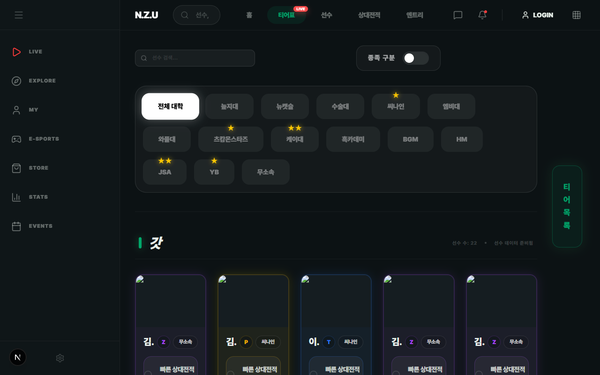
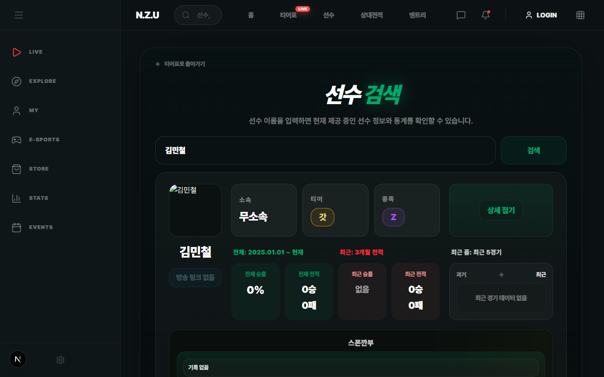
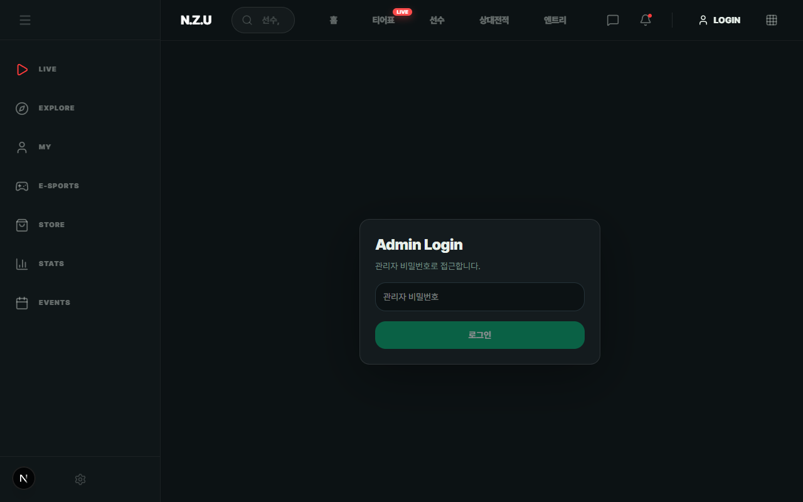
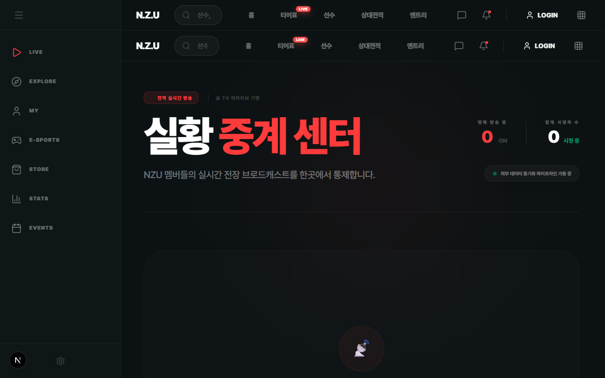
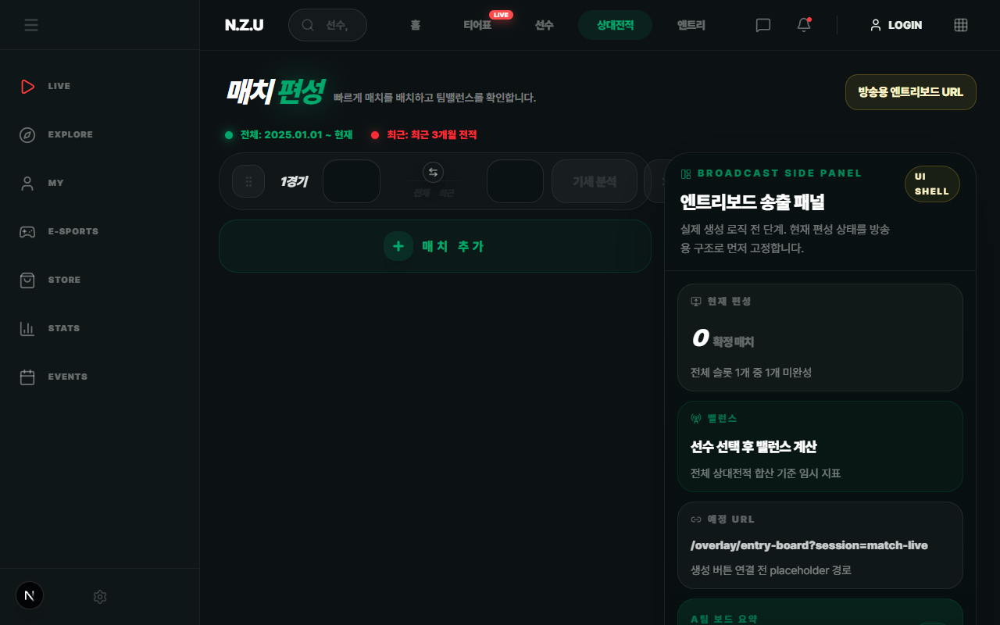
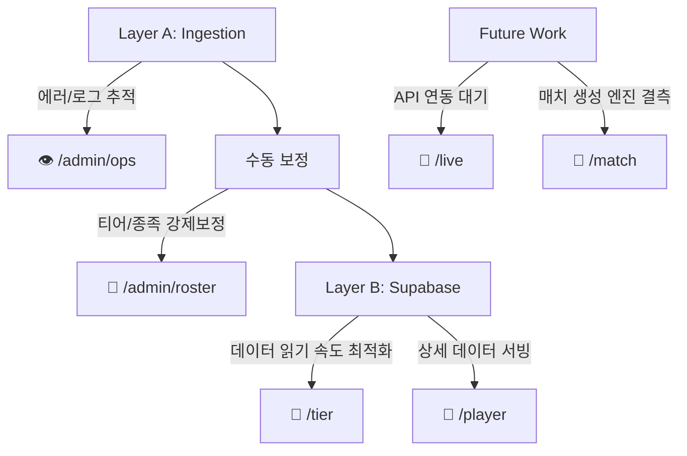

# NZU Homepage UI Supplementary PPT (Screenshots Attached)

이 문서는 구글 NotebookLM의 한계(로컬 이미지 삽입 불가)를 해결하기 위해, 로컬에 저장된 실제 스크린샷과 스크립트를 즉시 사용할 수 있도록 매핑해 둔 로컬 전용 보조 PPT 자료입니다.
우측 상단의 **'미리보기(Preview)'** 버튼을 누르시면 이미지가 바로 렌더링되어 보입니다!

---

## Slide 1: 퍼블릭 서빙 화면 (Public Serving Screens)
**검증된 데이터의 최종 종착지: 퍼블릭 서비스 화면**

> 런타임 스크래핑 없이, 파이프라인을 거쳐 정제된 '안전한 서빙 데이터'만 유저에게 노출됩니다. 무거운 연산이나 외부 크롤링 없이 오직 Supabase에 적재된 데이터를 빠르게 읽어옵니다.

**1. 전적 및 티어 뷰 (`/tier`)**

**2. 플레이어 상세 통계 뷰 (`/player/[id]`)**

---

## Slide 2: 고도화된 내부 운영 도구 (Private Admin & Ops Screens)
**시스템의 빈틈을 메우는 인간 개입: 어드민/운영 도구**

> 완전 자동화의 한계를 인정하고, 데이터 무결성을 보장하기 위해 설계된 강력한 수동 개입 인터페이스입니다. 관리자가 직접 에러를 보정하고 통제합니다.

**1. 파이프라인 및 운영 모니터링 (`/admin/ops`)**

**2. 수동 개입 및 데이터 덮어쓰기 (`/admin/roster`)**

---

## Slide 3: 프로토타입 및 과도기적 기능 (Transitional Screens)
**성장 중인 라이브 & 매치 인프라: 과도기 영역**

> 강력한 UI 프로토타입은 구현되었으나, 백엔드의 실제 데이터 엔진(Live API, Match Orchestration) 연동이 현재 병목 지점이며 향후 핵심 개발 영역입니다.

**1. 라이브 중계 UI (`/live`)**

**2. 향후 래더/엔트리를 담당할 셸 (`/match`)**

---

## Slide 4: UI와 메인 아키텍처의 연결 구조 (UI to Architecture Mapping)
**화면 뒤에 숨겨진 3계층 코어 아키텍처 매핑**

위에서 살펴본 화면들은 메인 아키텍처의 각 레이어(수집 ➔ 보정 ➔ 서빙 ➔ 병목)와 1:1로 맞닿아 있습니다.

