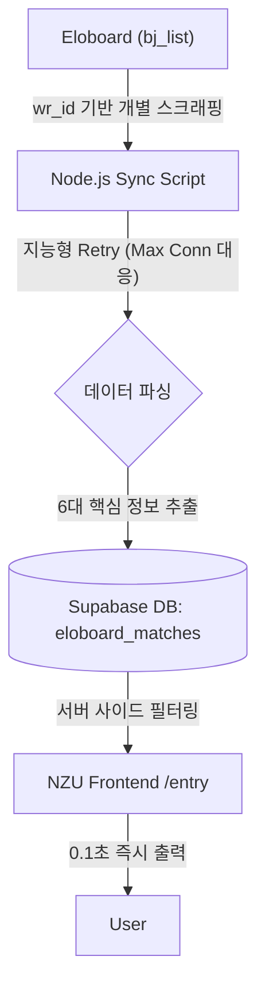

# SSUSTAR형 초고속 데이터 엔진 구축 계획서 (Data Engine V2)

SSUSTAR(`ssustar.iwinv.net`)의 데이터 수집 방식을 정밀 분석한 결과, **선수별 고유 ID(wr_id) 기반의 개별 스크래핑**과 **데이터 슬림화** 체계를 NZU 프로젝트에 완벽하게 이식하기 위한 수정 계획서를 보고드립니다.

---

## 🏗️ 1. 데이터 엔진 아키텍처 (SSUSTAR 방식)

SSUSTAR는 게시판 전체를 긁는 대신, 관리자가 등록한 선수별 Eloboard URL을 통해 직접 데이터를 동기화합니다.

---

## 📊 2. 데이터 슬림화 (Slimmed Data Structure)

SSUSTAR가 `chatbot.php` 등을 통해 활용하는 전적 데이터와 동일한 구조로 저장하여 호환성을 극대화합니다.

| 필드명 | 설명 | 예시 데이터 |
| :--- | :--- | :--- |
| `match_date` | 경기 날짜 | `2026-03-12` |
| `opponent` | 상대 이름 및 종족 | `쟌니(P)` |
| `map` | 맵 이름 | `라만차` |
| `result` | 승패 및 점수 | `-10.0` (패) / `+12.0` (승) |
| `turn` | 경기 회차 | `9/12(1)` |
| `memo` | 대회명 및 상세 정보 | `[LAS 시즌4] 16강` |

---

## 🔄 3. 고효율 동기화 및 안정화 전략

1.  **wr_id 기반 정밀 타격**: `players` 테이블에 `eloboard_id` 필드를 추가하여, 각 선수별 `bj_list` 페이지를 직접 조회합니다.
2.  **지능형 재시도 (Retry Logic)**: 
    *   Eloboard의 `max_user_connections` 오류 발생 시 2초~5초 간격으로 최대 3회 재시도.
    *   연속 실패 시 해당 선수는 건너뛰고 로그를 남겨 시스템 중단을 방지합니다.
3.  **차분 업데이트 (Incremental Sync)**:
    *   각 선수별로 DB에 저장된 최신 날짜 이후의 데이터만 `UPSERT` 하여 불필요한 트래픽을 방지합니다.
    *   **데이터 기준일**: SSUSTAR 데이터 분석 결과와 동일하게 **2025-01-01** 이후의 경기 전적만 수집하여 현시점 대학 대전의 트렌드를 정확히 반영합니다.

---

## 🛠️ 4. 단계별 구현 로드맵

### 1단계: Database 스키마 고도화
*   `players` 테이블에 `eloboard_id` (wr_id) 컬럼 추가.
*   `eloboard_matches`의 `sync_key` 로직을 SSUSTAR와 동일하게 [날짜+상대+결과+회차] 조합으로 강화.

### 2단계: SSUSTAR형 개별 스크래퍼 개발
*   `axios` + `cheerio` + `iconv-lite` (CP949 대응) 조합.
*   `https://eloboard.com/women/bbs/board.php?bo_table=bj_list&wr_id={id}` 페이지의 전적 테이블 파싱 엔진 구축.

### 3단계: 로컬 동기화 마스터 스크립트 구축
*   `player_metadata.json`의 ID를 기반으로 전 선수를 순회하며 동기화하는 `sync-master.js` 완성.
*   동기화 성공/실패 여부를 `sync_logs`에 기록.

### 4단계: H2H 고속 조회 API 연동
*   Supabase에서 두 선수의 대전 기록을 즉시 intersection하여 반환하는 로직 UI 반영.

---

## 🏁 5. 기대 효과

*   **데이터 신뢰도**: SSUSTAR가 사용하는 공신력 있는 개별 전적 데이터를 그대로 활용.
*   **시스템 안정성**: 사이트 과부하 시에도 재시도 로직을 통해 데이터 누락 최소화.
*   **확장성**: 추후 새로운 선수가 추가되어도 `wr_id`만 등록하면 즉시 전적 추적 가능.

**위 계획에 따라 SSUSTAR 방식의 "id 기반 정밀 스크래퍼"를 우선 개발하겠습니다. 동의하시면 바로 코드를 작성합니다.**
